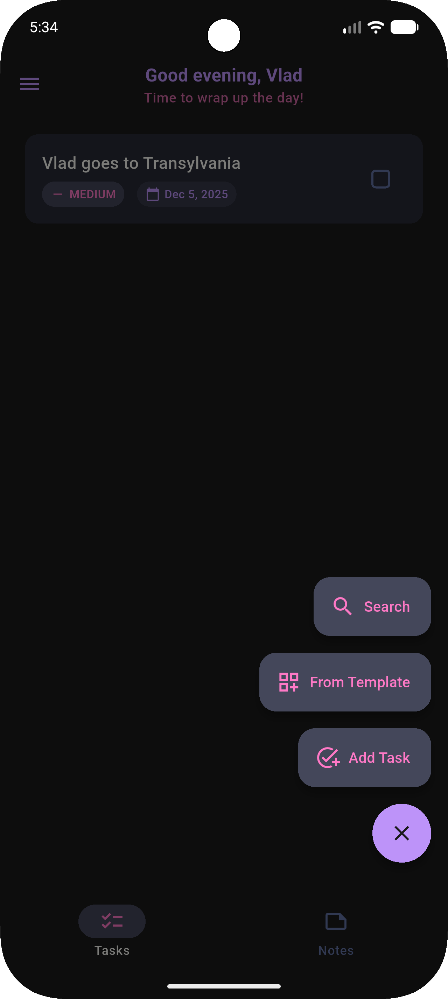

# Dracula for [Trudido](https://github.com/dominikmuellr/trudido)

> A dark theme for [Trudido](https://github.com/dominikmuellr/trudido).

## Install

Trudido comes with Dracula support built-in!

Go to Settings > Display & Theme > disable Dynamic Color if enabled > Accent Color  > Select Dracula

## Team

|  
| ---------------------------------------------------------------------------------------- |
| [Dominik Mueller](https://github.com/dominikmuellr)

## License

[MIT License](./LICENSE)
